# visiblelight
AI CloudOps Platform
# 🌌 Visible Light — Architecture Diagram & GitHub Project Board

Below are a visual architecture (Mermaid diagrams) and an opinionated GitHub Project setup you can paste directly into repos/org to operationalize the Supercluster → Harmonize → Automate roadmap.

---

## 1) Architecture Diagrams

### 1.1 High‑Level Flow (Centralize → Harmonize → Automate)

```mermaid
flowchart LR
  subgraph Client[Client Properties]
    WP[WordPress Sites\n(Luna Chat Widget, VL Demo Console)]
    Apps[Web Apps / SPAs]
    APIs[Existing Site APIs]
  end

  subgraph Edge[Edge / CDN]
    CDN[Cloudflare CDN / WAF]
  end

  subgraph Ingest[Ingest Layer]
    IGW[Ingest API\n(Node/Express)]
    KFK[(Kafka)]
  end

  subgraph Supercluster[Supercluster Core]
    AUTH[Auth0\n(Org/Tenant JWT)]
    VAULT[Token Vault\n(HVault / Supabase Vault)]
    CREG[Connector Registry\n(Postgres)]
    SREG[Schema Registry\n(JSON Schemas)]
    ADPT[Connector Adapters\n(GA, CF, Uptime, etc.)]
  end

  subgraph Storage[Storage]
    CH[(ClickHouse\nmetrics/events)]
    PG[(Postgres\nconfig/state)]
    S3[(Object Store)]
  end

  subgraph Services[Service Layer]
    INS[Insight API\n(Aggregations → AI-ready)]
    LORCH[Luna Orchestrator\n(Intent → Data → Action)]
    WAG[Work Agent Service\n(Jira/Slack/Email/Notion)]
  end

  subgraph UI[UI Layer]
    CON[Visible Light Console\n(React/Vite)]
    CHAT[Luna Chat (Widget + Console Pane)]
  end

  subgraph Ext[External SaaS/Cloud]
    GA[(Google Analytics)]
    CF[(Cloudflare)]
    UR[(UptimeRobot)]
    JIRA[(Jira)]
    SLK[(Slack)]
    SMTP[(SMTP/Email)]
  end

  Client -->|HTTPS| CDN --> IGW
  IGW --> KFK --> CH
  IGW --> PG
  IGW --> S3

  CON -->|OAuth| AUTH
  CHAT -->|JWT| LORCH

  LORCH --> INS
  INS --> CH

  LORCH --> WAG
  WAG --> JIRA
  WAG --> SLK
  WAG --> SMTP

  ADPT --> IGW
  CREG <--> ADPT
  SREG <--> ADPT
  VAULT <--> ADPT
  AUTH --> Supercluster

  ADPT --> GA
  ADPT --> CF
  ADPT --> UR
```

### 1.2 Sequence: “Ask Luna → Insight → Action”

```mermaid
sequenceDiagram
  autonumber
  participant User
  participant Widget as Luna Widget (WP)
  participant LOrch as Luna Orchestrator
  participant Insight as Insight API
  participant CH as ClickHouse
  participant Agent as Work Agent
  participant Jira as Jira

  User->>Widget: Ask: “Weekly SEO summary + open a follow-up ticket”
  Widget->>LOrch: JWT + Query
  LOrch->>Insight: Get last 7d metrics
  Insight->>CH: Aggregate (SEO, uptime, traffic)
  CH-->>Insight: Aggregates
  Insight-->>LOrch: Insight payload
  LOrch->>User: Draft answer + ask confirmation for ticket
  User-->>LOrch: Confirm
  LOrch->>Agent: createTicket({title, body, labels})
  Agent->>Jira: REST create issue
  Jira-->>Agent: Issue key
  Agent-->>LOrch: result {key}
  LOrch-->>Widget: Final response + link to ticket
```



### 1.3 C4-ish Component Map


---

## 2) GitHub Project Board (Org‑level)

> **Goal:** Provide a single pane of glass across repos (ingest-api, supercluster, ui-console, wp-plugins, work-agent, infra) with milestones, labels, views, and templates.

### 2.1 Project Fields (create in GitHub Projects → Settings)

* **Type**: Feature · Infra · Bug · Doc · Spike · Connector · Automation · Security
* **Pillar**: Centralize · Harmonize · Automate
* **Area**: Supercluster · Console · WP · Ingest · Insights · Agents · Infra · Auth · Data
* **Priority**: P0 · P1 · P2 · P3
* **Size**: XS · S · M · L · XL
* **Status**: Backlog · Ready · In Progress · Review · Blocked · Done
* **Target Quarter**: 2025Q4 · 2026Q1 · 2026Q2 · 2026Q3

### 2.2 Labels (org‑wide standard)

* `pillar:centralize`, `pillar:harmonize`, `pillar:automate`
* `area:supercluster`, `area:console`, `area:wp`, `area:ingest`, `area:insights`, `area:agents`, `area:infra`, `area:auth`, `area:data`
* `connector:ga`, `connector:cloudflare`, `connector:uptime`, `connector:mailchimp`, ...
* `priority:p0`..`priority:p3`, `size:xs`..`size:xl`
* `security`, `breaking-change`, `good-first-issue`, `help-wanted`

### 2.3 Milestones (align to roadmap)

* **Q4 2025** – Supercluster Foundations
* **Q1 2026** – Harmonization UI & Insights
* **Q2 2026** – Automations & Work Agents

### 2.4 Project Views (saved filters)

* **🛰 Executive View**: `Status != Done AND Priority in (P0, P1)` grouped by Pillar
* **🔌 Connectors**: `Type = Connector` grouped by Area
* **📊 Insights Feed**: `Area = Insights` sorted by Target Quarter
* **🧩 Platform**: `Area in (Supercluster, Ingest, Auth, Infra)`
* **🤖 Automations**: `Pillar = Automate` grouped by Status
* **🧪 Spikes**: `Type = Spike` sorted by created date

### 2.5 Issue Templates (drop in `.github/ISSUE_TEMPLATE/`)

**feature.yml**

```yaml
name: Feature
description: Propose a new feature
labels: ["type:feature"]
body:
  - type: input
    id: summary
    attributes:
      label: Summary
      placeholder: One line description
    validations:
      required: true
  - type: textarea
    id: problem
    attributes:
      label: Problem / Context
  - type: textarea
    id: proposal
    attributes:
      label: Proposal
      description: Include API surface, data model, UX notes
  - type: dropdown
    id: pillar
    attributes:
      label: Pillar
      options: [Centralize, Harmonize, Automate]
  - type: dropdown
    id: area
    attributes:
      label: Area
      options: [Supercluster, Console, WP, Ingest, Insights, Agents, Infra, Auth, Data]
  - type: dropdown
    id: priority
    attributes:
      label: Priority
      options: [P0, P1, P2, P3]
  - type: dropdown
    id: size
    attributes:
      label: Size
      options: [XS, S, M, L, XL]
```

**bug.yml**

```yaml
name: Bug
description: Report a defect
labels: ["type:bug"]
body:
  - type: input
    id: summary
    attributes:
      label: Summary
    validations:
      required: true
  - type: textarea
    id: repro
    attributes:
      label: Steps to Reproduce
  - type: textarea
    id: expected
    attributes:
      label: Expected
  - type: textarea
    id: actual
    attributes:
      label: Actual
  - type: textarea
    id: logs
    attributes:
      label: Logs / Screenshots
  - type: dropdown
    id: priority
    attributes:
      label: Priority
      options: [P0, P1, P2, P3]
```

**connector.yml**

```yaml
name: Connector Request
description: Add or enhance a data connector
labels: ["type:connector"]
body:
  - type: input
    id: provider
    attributes:
      label: Provider (e.g., Google Analytics, Cloudflare)
  - type: textarea
    id: scopes
    attributes:
      label: Required OAuth Scopes
  - type: textarea
    id: schema
    attributes:
      label: Data Schema (entities/fields)
  - type: textarea
    id: sync
    attributes:
      label: Sync Strategy (polling, webhooks)
  - type: textarea
    id: rate
    attributes:
      label: Rate Limits & Backoff
```

**automation.yml**

```yaml
name: Automation / Playbook
description: Propose an automation or multi-step playbook
labels: ["type:automation"]
body:
  - type: input
    id: title
    attributes:
      label: Title
  - type: textarea
    id: trigger
    attributes:
      label: Trigger (event/cron/manual)
  - type: textarea
    id: steps
    attributes:
      label: Steps (YAML or list)
  - type: textarea
    id: success
    attributes:
      label: Success Criteria / Rollback
```

### 2.6 Pull Request Template (drop in `.github/pull_request_template.md`)

```md
## Summary

## Changes
- [ ] Code
- [ ] Docs
- [ ] Tests

## Testing

## Linked Issues
Closes #123
```

### 2.7 Repo Layout (suggested top-level)

```
visiblelight/
  apps/
    console/           # React/Vite UI
    ingest-api/        # Node/Express -> Kafka
    insights/          # Aggregations + REST
    work-agent/        # Jira/Slack/Email adapters
  services/
    supercluster/      # Connector/Schema/Token APIs
  infra/
    terraform/
    k8s/
  packages/
    connectors/        # TypeScript SDK
    ui/                # Shared React components
  .github/
    ISSUE_TEMPLATE/
    workflows/
```

### 2.8 Starter GitHub Actions (drop in `.github/workflows/ci.yml`)

```yaml
name: CI
on:
  push:
    branches: [ main ]
  pull_request:

jobs:
  build:
    runs-on: ubuntu-latest
    steps:
      - uses: actions/checkout@v4
      - uses: actions/setup-node@v4
        with:
          node-version: '20'
          cache: 'npm'
      - run: npm ci
      - run: npm run -w apps/console build
      - run: npm run -w apps/ingest-api test --if-present
```

### 2.9 Project Automation Ideas

* Auto‑label issues by directory path (action: `globs-to-labels`).
* Transition `Status` to **Review** when a PR references the issue.
* Close issue when PR merges and set `Status` → **Done**.
* Nightly job to summarize activity → post to Slack via Webhook.

---

## 3) What to Implement Next (Cut‑and‑Run Tasks)

* Create org project with fields above and saved views.
* Add issue templates + PR template.
* Stand up `apps/ingest-api` + `services/supercluster` repos and wire CI.
* Paste the Mermaid diagrams into your architecture docs/Wiki.

> If you want this split into **multiple files** (repo seeds with folders and ready‑to‑commit templates), say the word and I’ll generate a zip‑ready structure you can drag into GitHub.
